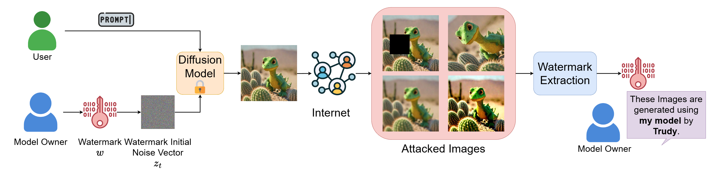
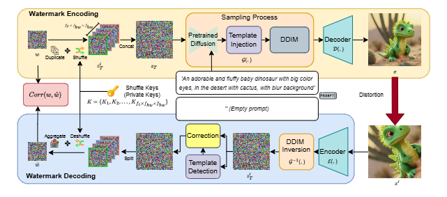
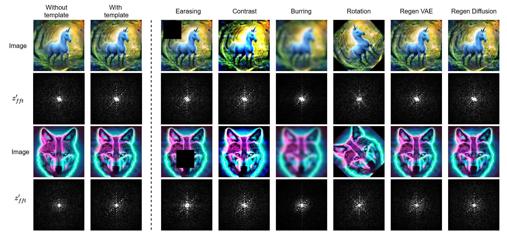

## Key Contributions

- **High Capacity Training-free Algorithm**: Based on Shannon entropy, MaXsive achieves significantly higher watermark capacity than previous training-free methods. This reduces the risk of ID collusion and enables real-world deployment without the need for additional fine-tuning.
- **Robust Diffusion Watermarking**: MaXsive outperforms existing training-free diffusion-based generative watermarking algorithms, offering superior robustness in both identification and verification settings.
- **Novel Approach to RST Attack Resistance**: MaXsive is the first to introduce the template for diffusion model watermarking, which effectively resolve RST (Rotation, Scaling, and Translation) attacks. Unlike previous algorithms using meticulously designed patterns, our template and watermark are not coupled together so as not to affect watermark capacity.

## Abstract
The great success of the diffusion model in image synthesis led to the release of gigantic commercial models, raising the issue of copyright protection and inappropriate content generation. Training-free diffusion watermarking provides a low-cost solution for these issues. However, the prior works remain vulnerable to rotation, scaling, and translation (RST) attacks. Although some methods employ meticulously designed patterns to mitigate this issue, they often reduce watermark capacity, which can result in identity (ID) collusion. To address these problems, we propose MaXsive, a training-free diffusion model generative watermarking technique that has high capacity and robustness. MaXsive best utilizes the initial noise to watermark the diffusion model. Moreover, instead of using a meticulously repetitive ring pattern, we propose injecting the X-shape template to recover the RST distortions. This design significantly increases robustness without losing any capacity, making ID collusion less likely to happen. The effectiveness of MaXsive has been verified on two well-known watermarking benchmarks under the scenarios of verification and identification.

## Application Scenario

    

        
    

<!--  -->
*Real-World Applications of training-free diffusion watermarking algorithms.*

## MaXive Framework

    

        
    

<!--  -->
*The framework of MaXsive. The watermark is a comparably small dimension vector sample from an ideal Gaussian distribution. The watermark is duplicated and encrypted by private keys, forming the input noise of the diffusion model.*

## Template Robustness

    

        
    

<!--  -->
*Visualization of the template space (second and fourth rows) under various distortions. To the left of the dashed line, images generated by Stable Diffusion 2.1 share the same prompt and initial noise, with template injections applied in the second column. The corresponding distorted template images are presented to the right of the dashed line.*
